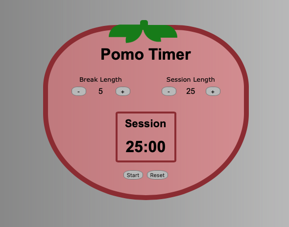

# 25 + 5 Timer App

A basic pomodoro timer app built for the freeCodeCamp front-end development certificate.

Please check out a live build [here](https://aaronishibashi.com/portfolio/web/pomotimer)

## Tools
- React, front-end library
- Redux, state management
- TypeScript, JS pre-processor
- Stylus, CSS pre-processor
- Jest, unit tests
- Webpack, bundling
- Deflemask, audio

## Build

To build, run  `npm install` and `npm run build`, then to view, run a live server in the "dist" directory

### Other build info
The npm packages also include electron as a dev dependency, which may be run by calling `npx electron .`

The project contains a test suite to prove passing status for freeCodeCamp ceritification, but may be easily removed by deleting the script tag at the bottom of dist/index.html

audio/alarm-sound.dmf can be opened and exported in Deflemask Tracker, but a pre-exported wav is included in dist/
